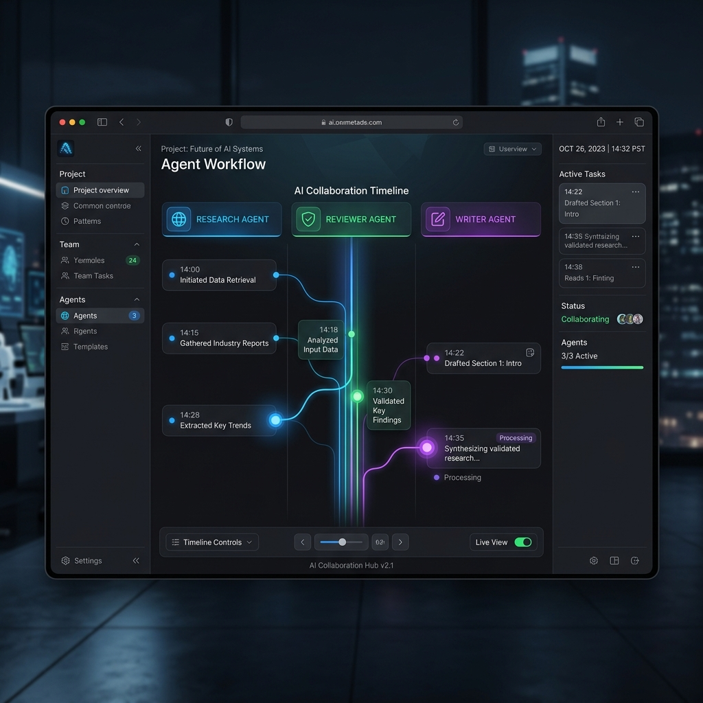
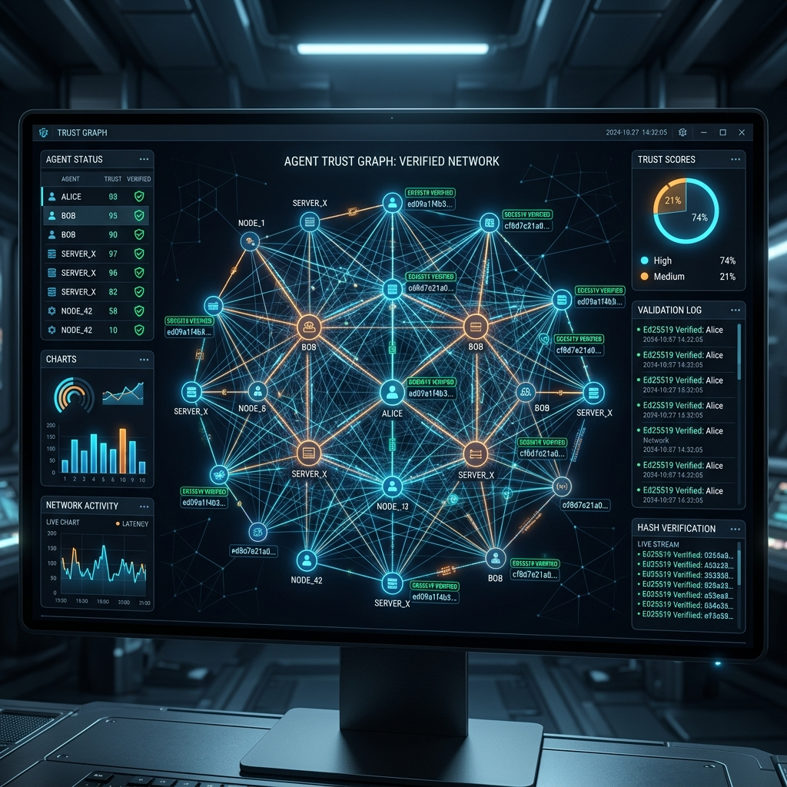
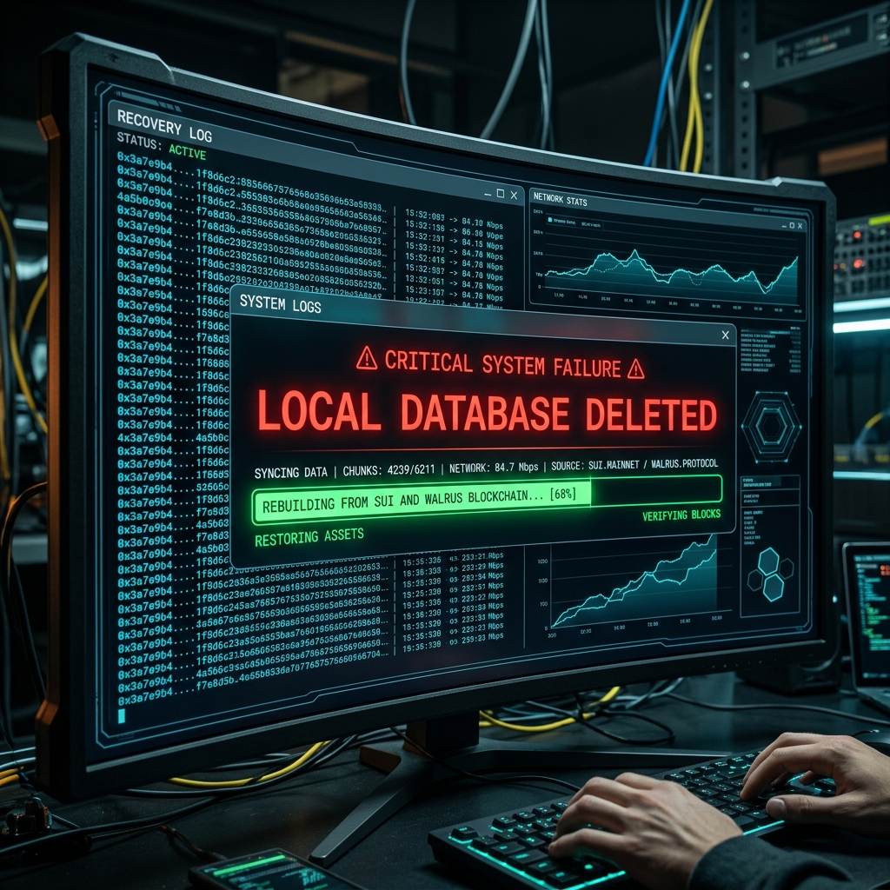

# WalrusOS Official Demonstration

Welcome to the definitive showcase of **WalrusOS**—the decentralized operating system for Agentic AI.

This demonstration runs entirely locally using the mock in-memory adapter, allowing you to experience the core features of WalrusOS without configuring Walrus Storage or Sui RPC nodes.

## The Storyline

In this demo, three independent AI agents are collaborating on a complex report:
1. **ResearchAgent**: Gathers initial findings.
2. **ReviewerAgent**: Reviews and approves the findings.
3. **WriterAgent**: Drafts the final report.

The demonstration walks through five cinematic scenes showcasing the power of WalrusOS:

### Scene 1: Persistent Identity
The ResearchAgent initializes the system and appends its findings to a shared `collaboration` memory stream.

### Scene 2: Sui Capabilities
The ReviewerAgent attempts to append a review but is **rejected** because it lacks the required cryptographic `AppendCapability`. An admin grants the capability on the simulated Sui ledger, allowing the agent to finally append the review.

### Scene 3: Branching & The Trust Graph
The WriterAgent forks the `collaboration` stream to explore a "Creative Draft." As events are appended, cryptographic `TrustRoots` are calculated, forming the basis of the agent Trust Graph.




### Scene 4: Cryptographic Verification
A malicious actor corrupts the local SQLite database by modifying the WriterAgent's draft. When the system attempts to read the timeline, a `CryptographicVerificationError` is thrown, catching the tampered signature immediately.

### Scene 5: Catastrophic Disaster Recovery
The ultimate test of WalrusOS. The entire local configuration, SQLite database, and indices (`~/.walrusos/`) are physically deleted. 

A fresh instance of WalrusOS is booted, and it natively reconstructs the exact timeline, cryptographic signatures, and capabilities directly from the (simulated) Walrus Decentralized Storage Network.



---

## How to Run

Execute the demo script using Python (requires `walrusos` to be installed or in your `PYTHONPATH`):

```bash
python demo/run.py
```

## Additional Assets
- [Video Script](video_script.md)
- [Architecture Diagram](architecture.mmd)
